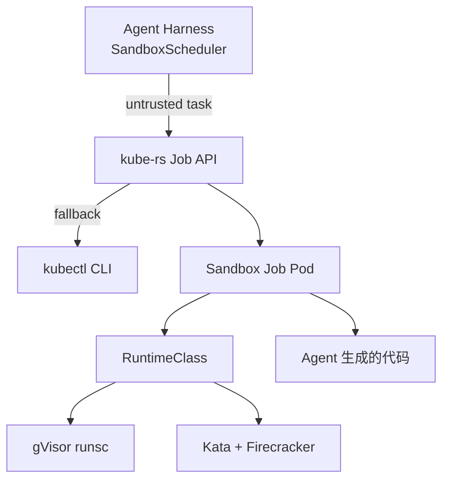

# Kubernetes 沙箱部署指南

Phase 3：通过 K8s RuntimeClass 集成 gVisor / Firecracker（Kata Containers），
实现生产级 Agent 代码隔离。

## 架构



## 前置条件

| 组件 | 用途 | 安装 |
|------|------|------|
| **gVisor** | 用户态内核隔离 | [gvisor.dev](https://gvisor.dev/docs/user_guide/install/) |
| **Kata Containers** | Firecracker 微 VM | [katacontainers.io](https://katacontainers.io/) |
| **RuntimeClass** | K8s 选择运行时 | K8s 1.12+ 内置 |

## 快速部署

```bash
# 1. 创建 namespace
kubectl apply -f deploy/k8s/namespace.yaml

# 2. 安装 RuntimeClass（按环境选择一种或多种）
kubectl apply -f deploy/k8s/runtimeclass-gvisor.yaml
kubectl apply -f deploy/k8s/runtimeclass-kata.yaml

# 3. 验证 RuntimeClass
kubectl get runtimeclass

# 4. 测试沙箱 Job
kubectl apply -f deploy/k8s/sandbox-job-example.yaml
kubectl wait --for=condition=complete job/sandbox-test -n agent-sandbox --timeout=60s
kubectl logs job/sandbox-test -n agent-sandbox
```

## 从 Rust 调用

```rust
use harness_sandbox::{SandboxPolicy, SandboxScheduler, SandboxConfig};

let scheduler = SandboxScheduler::with_defaults()?;

// 可信任务 → Process 沙箱
let result = scheduler.exec("trusted", "echo", &["hello"]).await?;

// AI 生成代码 → Wasm 沙箱
let result = scheduler.exec_wasm(wat_bytes, "main", &[]).await?;

// 不可信 shell → K8s MicroVM（默认 kube-rs API，失败时 fallback kubectl）
std::env::set_var("SANDBOX_RUNTIME_CLASS", "gvisor");
std::env::set_var("SANDBOX_K8S_BACKEND", "kube"); // 或 "kubectl"
let result = scheduler.exec("untrusted", "sh", &["-c", "echo safe"]).await?;
```

### In-cluster 部署

Agent Pod 通过 ServiceAccount + RBAC 直接调用 K8s API（无需 kubectl 二进制）：

```bash
helm install agent-harness deploy/helm/agent-harness \
  --set sandbox.runtimeClass=gvisor \
  --set sandbox.k8sBackend=kube
```

本地开发仍可使用 `SANDBOX_K8S_BACKEND=kubectl`。

## RuntimeClass 对比

| RuntimeClass | 底层 | 隔离级别 | 启动时间 | 平台 |
|-------------|------|----------|----------|------|
| `gvisor` | runsc (用户态内核) | 高 | ~100ms | Linux |
| `kata-fc` | Kata + Firecracker | 最高 | ~125ms | Linux + KVM |

## Helm 部署（Agent Harness 平台）

```bash
helm install agent-harness deploy/helm/agent-harness \
  --set sandbox.runtimeClass=gvisor \
  --set sandbox.enabled=true
```

## 安全策略

Sandbox Job 默认配置：

- `runAsNonRoot: true`
- `readOnlyRootFilesystem: true`
- `allowPrivilegeEscalation: false`
- CPU / Memory limits
- `ttlSecondsAfterFinished: 120`（自动清理）
- `backoffLimit: 0`（不重试失败任务）
